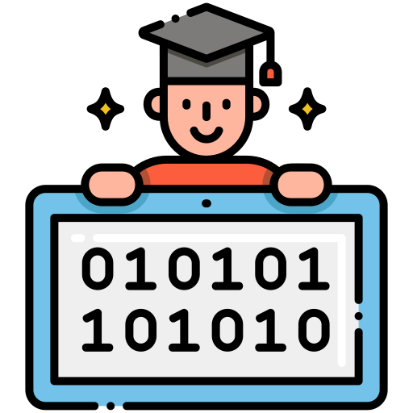
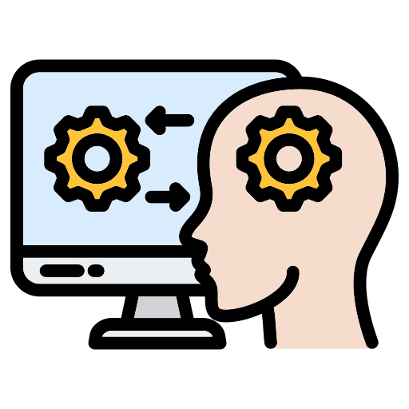

  
  
  

Growing up with a brother with a developmental disability meant that I could watch how technology has made an impact on his life. From enhancing his education to cater to his needs, to allowing him to socialize with others, technology has granted him a sense of independence and has enabled him in many ways. He has inspired my desire to explore human-computer interaction and how we can make technology as accessible as possible.

From a young age, I have always been fascinated by technology, but more so by the interactions between humans and machines. I believe that technology should be accessible to everyone. It should be easy and intuitive for anyone to use, whether one is young or old, disabled or able-bodied. I’m particularly interested in technology that would help people who live with cognitive disabilities. Today’s technology is constantly updating and changing and it is revolutionizing how we interact with each other and the things in our world, but I want to focus on how humans interact with technology.

Beyond my education, I envision myself as a software engineer, working on projects dedicated to breaking down barriers for impaired individuals. I am deeply passionate about harnessing the power of AI-driven language models to facilitate natural interactions for users with cognitive challenges, envisioning applications not only in general software interfaces but also in specialized areas such as speech therapy. My commitment is to contribute to the forefront of technology by developing user interfaces tailored to diverse needs, incorporating cutting-edge AI solutions, and ultimately empowering and fostering independence for this often underserved group of individuals.

I am deeply interested in the intersections of not only human-computer interaction, machine learning, and artificial intelligence but also the applications of natural language processing. I want to deepen my understanding of these subjects to create innovative solutions that bridge the gap between human needs and technological capabilities. I am eager to immerse myself in the challenges and opportunities that lie ahead of me, and I am confident that my passion and dedication to accessible technology will leave a lasting and meaningful impact on the field.
