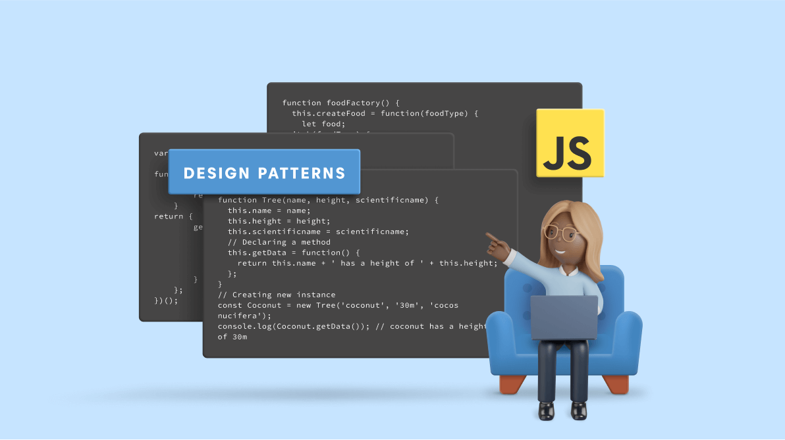

Programming is a lot like cooking. Every chef knows how to follow a recipe to create a reproducible dish. However, the best chefs know how to customize a recipe and improve it to make something unique. If the components of your code are the ingredients, then design patterns are like the recipes.

Design patterns are pretty much exactly what they sound like– They are repeated patterns seen in software design across any software. Design patterns provide typical solutions to commonly recurring problems in software design. They improve code reusability and can even optimize it. You might even already be following some common design patterns without even realizing it!

Here, I’ll talk about some design patterns I’ve noticed in my code.

## Module Pattern

The module pattern is probably the one you are the most familiar with, even if you didn’t know what design patterns were before reading this. The module pattern is splitting up your code into smaller bits and pieces to become more manageable and structured. Being able to split your code, encapsulates data and allows you to manage private and public access to data and methods.

An example of this in my final project is our App.jsx file imports all the different pages across the website that is accessible from the NavBar. However, it doesn’t import any of the methods or components that are only accessible from certain pages. It helps us control the visibility of the website pages seen by the user. It also helps us work on the website in more manageable chunks and troubleshoot easily when things go wrong.

## Observer Pattern

With the observer pattern, we can subscribe certain objects, the observers, to another object, called the observable. Whenever an event occurs, the observable notifies all its observers. Take for example, an online newsletter. When you subscribe to a newsletter, you no longer have to keep returning to the website to check for new updates. Instead, the publisher sends something straight to your inbox. The publisher can keep track of who's subscribed to the newsletter, and can send it to anyone who’s interested, and those who aren’t won’t be bombarded with spam mail.

In my final project, there are 3 different publications for our Card collection: All Cards, Admin Cards, and User’s Cards. Having the 3 different publications means we can choose which one’s we want to subscribe to on each page. For instance, our ‘Marketplace’ page is subscribed to All Cards, because it needs to check all the cards across all user accounts for the ones on sale. However, our ‘Your Cards’ page is subscribed only to User’s Cards, because we only want to see the cards they own on the page.

## Singleton Pattern (Collections)

Speaking of collections, they follow a Singleton pattern. Singleton is a creational design pattern that lets you ensure that a class has only one instance, while providing a global access point to this instance. You can think of it as a single, all encompassing, body of government. For example, the United States has only one government (single instance), which encompasses many different branches and departments (your data and methods), and this government is the global point of access to everyone in charge.

In my final project, this is represented by the different collections. Our Card collection encompasses all the different sets of cards previously mentioned, and there is only ever one instance of this collection. We are not making multiple instances of the Card collection and we are able to call methods and manipulate the objects inside by accessing this collection.

You might have been taught to use design patterns without even realizing it. When I was writing my code, I didn’t even know I was following design patterns, because I was simply copying structures I’ve seen in other pieces of code. Design patterns are used because they work really well solving commonly recurring problems. 
