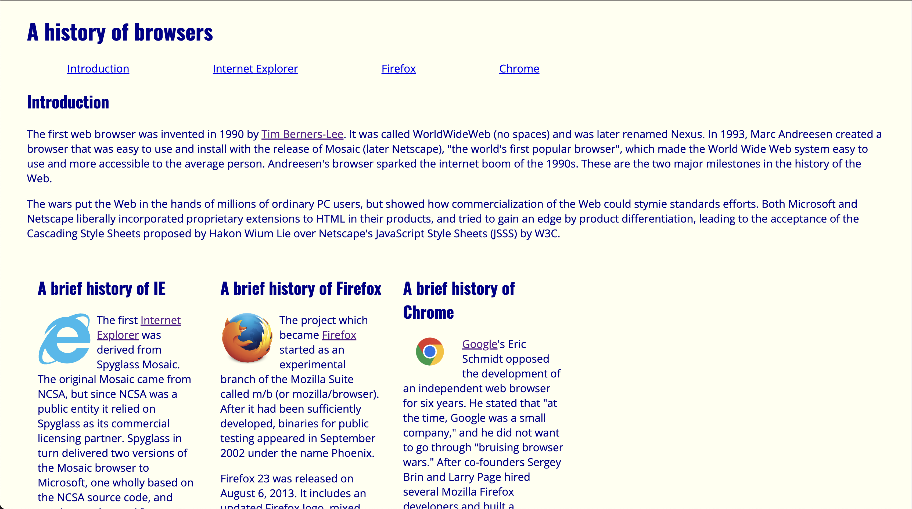
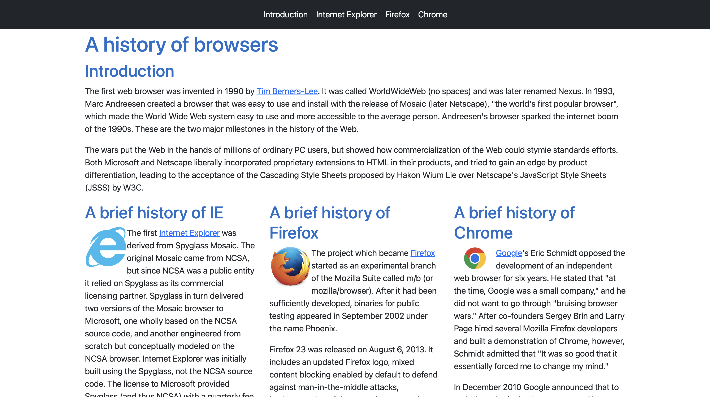

Bootstrap 5 is a powerful open-source UI framework used by thousands of developers to streamline styling HTML pages. I know a lot of developers who don’t care for design theory, but Bootstrap 5 follows a standard design and coding convention, which allows them to implement and style elements without having to worry about the nitty gritty stuff while saving tons of time. Especially when implementing similar elements over and over again, using a UI framework makes your life so much easier. Even more awesome, Bootstrap 5 follows a mobile-first approach, which makes your pages responsive and look good on all devices!

## Hey Google, how do I center a div?

Let’s be real, you’ve probably searched up “how to center a div” at least once in your coding career, haven’t you? It’s crazy right? It sounds so simple, but somehow this elusive quest stumps so many.

I remember spending forever messing around with CSS trying to center a 3 column layout in the middle of the page. Learning how to utilize flexboxes was a god-send, but even then, centering a div was one too many lines to remember. Now, I won’t sit here and lie and say that Bootstrap made centering a div much easier. Learning to use Bootstrap is no easy feat. You might as well learn a whole new programming language. It was like learning to swim for the first time but you were thrown in the middle of an ocean with not much else. I found Bootstrap to be sooo frustrating at first. Unless you super familiar with CSS, Bootstrap can be quite difficult to grasp at first. I spent a lot more time reading the documentation rather than coding the actual website. When it came to centering a div, you still needed to know how to center it in raw CSS to have an idea of how to center it using the built in classes from Bootstrap. However, once I started to get the hang of it, Bootstrap became a little easier to use.

## Raw vs Refined Code

Let’s look at the difference in code between Bootstrap and raw HTML + CSS to center a div.

In raw HTML/CSS:

``` html
<style>
    body, html {
        height: 100%;
        margin: 0;
    }
    .container {
        height: 100%;
        display: flex;
        justify-content: center;
        align-items: center;
    }

    .center {
        text-align: center;
    }
</style>
</head>

<body>
<div class=“container”>
    <div class="center">
        <p>This div is centered!</p>
    </div>
</div>	
</body>
```

In Bootstrap:
``` html
<body>
<div class="container d-flex justify-content-center align-items-center">
    <div class="text-center">
        <p>This div is centered!</p>
    </div>
</div>
</body>
```

As you can see, the Bootstrap code and the CSS code practically say the same exact stuff, but when you throw the raw CSS into a stylesheet that stylizes fifty other elements, you'd want to save some time AND clean up the code with some Bootstrap instead! Bootstrap already defines these classes without you having to lift a finger.

## Side by Side Comparison
Not only does Bootstrap save you some lines of code, but it also makes styling website a breeze. If you want to make a website quickly with a nice modern theme, Bootstrap is the way to go. Since it includes it owns fonts, colors, and features you don't have to think too much about design theory because it stylizes elements for you with that in mind.

Take a look at a side by side comparison of the same website. The left side was built without Bootstrap, and the right was made with Bootstrap:
<div style="display: inline-flex">
 

</div>

Look how nice that is! Isn't it wonderful? So clean and sleek? It definitely looks like it was designed by a pro. My favorite part about the Bootstrap version is the navbar. What's great about Bootstrap is the ability to look at something from the documentation and if you like it, you can just copy and paste it. Change a few thing to customize it to your liking, and then boom! You've got it. That's the amazing thing about UI Frameworks. They're basically just templates and tools for developers to make our lives easier. You don't have to be artsy to make some classy looking front-end work.