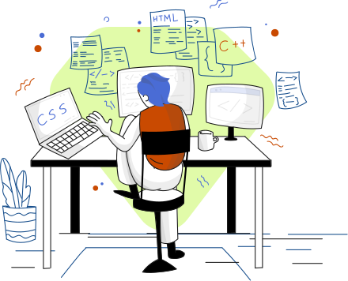

It's been a looooong semester, but by far, I'd have to say this one's been the most fun. ICS 314: Software Engineering has easily won my heart for being my favorite course I've taken so far in my academic journey. I've gained a lot of new skills and gave it my all for my [final project](/projects/proftcg.html). Before I continue my journey as a Computer Science student, I'd like to look back and reflect on the lessons I've learned in this class. 

## Divide and Conquer Like a Boss
Agile Project Management is a flexible, collaborative, and iterative approach to project management. It involves breaking down large projects into smaller cycles, or sprints, and guiding teams through planning, execution, and evaluation. APM allows teams to work quickly and adapt to changing requirements. In ICS 314, we used a methodology called Issue Driven Project Management (IDPM), which works by dividing and conquering. This involved utilizing GitHub's Issue feature and Project Board feature. Essentially, we broke down our project into milestones, for which we created realistic goals about what we wanted to accomplish by the end of each milestone. We then created "issues" or tasks and assigned them evenly amongst each member. Our project board was sectioned into "To-Do", "In-Progress", and "Done" for each milestone. If we felt that an new issue had arise after finishing one, we would add it to our project board. This method allowed us to break down our project into simple, more manageable parts. I also liked how we could see how much progress we made on the project based on how many issues were completed. Outside of software engineering, I could see myself using this type of methodology on other projects. For instance, if I were doing a research project, I think that I could apply IDPM to help manage my work. I could break down my research question into smaller, related questions that could help lead me to my answer. When a new question arises, I can add it to my list of questions to research deeper into. Taking the culmination of these smaller answers will help me form the answer to my big question.

## Get In, We're Designing UI
User Interface Frameworks is one of my favorite concepts we learned in class because of how they make designing web applications so much faster and easier. In class, we used Bootstrap 5, which is a powerful open-source UI framework used by thousands of developers to streamline styling HTML pages. What I loved the most is that it did not require you to have any prior design knowledge to make something look good. You can read more about my experience using Bootstrap 5
[here](/essays/getting-classy-with-bootstrap-5.html). This reminded me of when I learned app development in high school and I worked with Swift. SwiftUI is Apple's user interface framework for building user interfaces for Apple based operating systems. Learning User Interface Frameworks lets you design a website without having to worry about styling it. Of course, I still get confused about which Bootstrap classes to use to center a div, but it's a lot less lines of code I have to write to do that. Bootstrap 5 has made me curious about other UI frameworks, like Tailwind and Flutter, that I want to explore in the future as well.

## Clean Up on Line 22 Col 24
I get why some people grumble over coding standards, but I think coding standards makes you a smarter and better programmer. As a beginner, reading documentation about coding standards may seem like a daunting task. It feels like an endless scroll of words and code, you might think "who has time for that?" Many beginner programmers have that notion of "if it works, it works". However, I truly believe that following coding standards makes you a better, smarter programmer. Throughout the semester, we've been using ESLint to adhere to the AirBnB coding standards. I've learned that in a collaborative project, coding standards have proven to be really useful and important in writing clean, easy to follow code. I've also really learned the important of spacings and writing comments to help distinguish parts of your code and make it easy for yourself to understand what is going on. It's helped a lot in debugging and developing our project. Beyond web development, following coding standards is just good practice. If I were developing software for a space rover, I'd want to make sure that my code was clean and easy to follow, that way if anything went wrong, someone else could easily review my code.

## Overall...
Overall, I felt that this was a pretty successful semester of learning new things and putting my coding skills to the test. I'm excited because this class has given me a taste of what software engineering is like and it's something that I truly enjoyed learning. I'm looking forward to the rest of journey as a computer science student, and I can't wait to apply my newfound skills in my future courses!