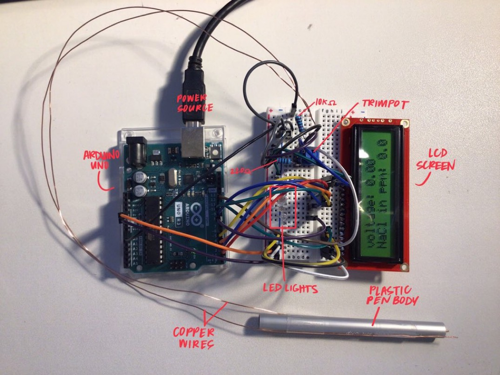

In 2022, I competed in the Oahu Leeward Regional Science Olympiad, where I participated in the Detector Building event. In the Detector Building event, teams of up to 2 are expected to build a sensing device prior to event day that can accurately measure the ppm of NaCl in a water sample, while also displaying a related LED color. My partner and I won first place among ~10 other teams. 

Using prototype materials, we built an electronic probe from scratch to measure the salinity of water samples. As shown in the picture, the probe itself was built using only copper wires and a plastic pen body, which is all you need for measuring conductivity. Writing the program required an understanding of electrochemistry topics such as electrolysis and how conductivity of a solution is related to concentration. The relationship between conductivity and concentration is linear. The code involves reading the analog input obtained by the probe and converting it to voltage, and then to conductivity by taking the inverse of resistivity. From there, we tested the probe using samples with known values of NaCl concentrations and used a spreadsheet to determine a line of best fit. 

Through this project, I learned how to program an Arduino, how to design and build circuits, and I developed basic skills in electrical engineering. I got to practice soldering with the LCD screen. I also learned a lot about electrochemistry and electricity in physics. I was already familiar with programming through Java, though this was my first time coding in C++ with an Arduino. 