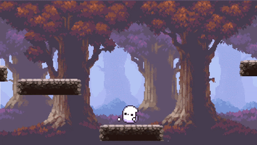

**Lyla's Ghostly Adventures** is a JavaScript-based platformer game developed using Scratch. In the game, you play as Lyla the Ghost who lives in a forest, and you must collect various items to befriend the folks from a nearby village. It was made as part of my Game Development & App Design internship with [Pilina Education](https://www.pilinaeducation.org/). Pilina Education provides work-based learning opportunities for high school students. At the end of my internship I got to present my project to industry professionals during a final showcase.

Throughout my internship, I worked on designing a level