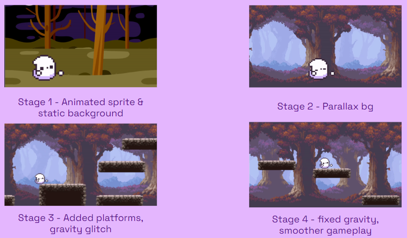

**Lyla's Ghostly Adventures** is a JavaScript-based platformer game developed using Scratch. In the game, you play as Lyla, a shy ghost, who is lost and must collect spirit orbs to find her way back home. It was made as part of my Game Development & App Design internship with [Pilina Education](https://www.pilinaeducation.org/). Pilina Education provides work-based learning opportunities for high school students. At the end of my internship I got to present my project to industry professionals during a final showcase.

Throughout my internship, I worked on designing and coding a simple level as a demo for the final showcase. The sprites and background and platform tiles were found from [Spriter's Resource](https://www.spriters-resource.com/pc_computer/forager/sheet/133917/) and [itch.io](https://brullov.itch.io/oak-woods). The biggest challenge for me was coding the parallax background and implementing gravity into the game.

Throughout the program, I improved my JavaScript skills. I can quickly code in JavaScript and I developed my UI design skills as well. Although I did not create the assets myself, I did learn about color theory and design. I learned about what colors would go together and how to use colors to help certain sprites stand out.