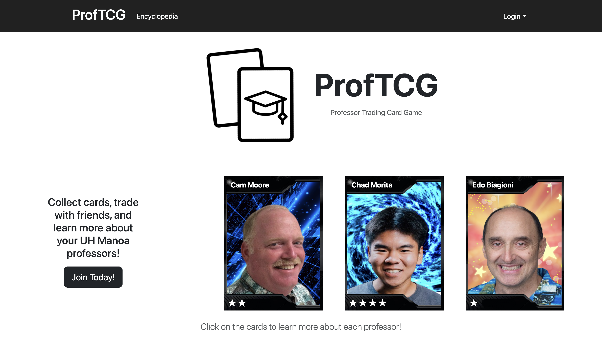
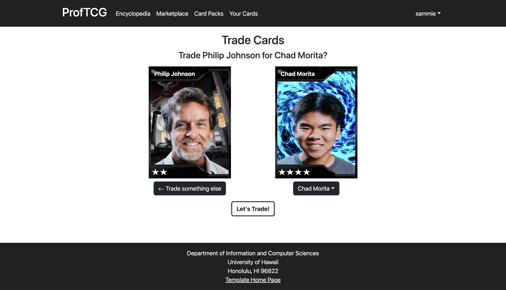

## ProfTCG: Collect and trade your favorite UH Manoa professors!
### Project Overview
ProfTCG is a simple trading card web application where users can open card packs, trade with friends, and learn more about their UH Manoa professors. While studying at a large university such as UH Manoa, students can feel disconnected from their professors, whether it be due to large class sizes or even just a lack of personal interaction in small classes. As a student interested in research and graduate school, I was always interested in what my professors were working on and I was always looking for potential mentors. In large classes, I found that it can be difficult to network and make connections with professors and ask those questions directly. When talking to my team about ideas for a final project for our software engineering class, many of us shared the same sentiments. That's what brought us to come up with a professor trading card game. 

Trading card games are very popular, and this neat twist intends to bring together students and faculty in the UH Manoa community. It encourages students to make friends and bond with their classmates. Every 24 hours, students can open a card pack to receive new trading cards containing fun facts about each professor. Each trading card is unique to the current semester and copies are limited, which encourages students to check in every day to collect trading cards of varying styles and rarity. Learning more about their research and projects may inspire students interested in conducting their own research and projects to come up with ideas and seek out potential mentors. "Game" is used very lightly in the sense that the cards act more like baseball trading cards rather than Pokemon cards, however in the future we would like to include a leaderboard aspect where your score is based on the sum of the rarities of each card you own.

### Personal Contributions
For this project, I mainly worked on the landing page, trade page, and the backend trade mechanics. I also designed the branding for the website. Click on the images to view the source code!

<a href="https://github.com/ProfTCG/proftcg/blob/main/app/imports/ui/pages/Landing.jsx">

</a>

For the landing page, I wanted to keep a sleek, minimalistic design for the branding in order to make the cards stand out on the page. Since the cards were varying vibrant colors, I opted to keep a black and white theme that contrasted well with them. What I find to be the most fun about the landing page is that the 3 cards randomly change each time you load the page. This is done by shuffling the array of cards from the card collection, and then loading in the first 3 cards in the array.

<a href="https://github.com/ProfTCG/proftcg/blob/main/app/imports/ui/pages/TradeCard.jsx">

</a>
For the trade page, I wanted to create a dropdown menu that changes the rendered card based on what card is selected. When you click "Let's Trade!", it calls a 'TradeCard' method that swaps the owners of the cards, placing the card in your inventory. The 'TradeCard' method calls a Meteor method called 'Cards.trade', which can be seen here:

```js

  'Cards.trade'(cardId1, cardId2) {
    // Validate method arguments
    check(cardId1, String);
    check(cardId2, String);

    // Retrieve the cards by their IDs
    const card1 = Cards.collection.findOne(cardId1);
    const card2 = Cards.collection.findOne(cardId2);
    
    // Store owner info
    const owner1 = card1.owner;
    const owner2 = card2.owner;

    // Ensure rarity checks
    if (card2.rarity < card1.rarity) {
      throw new Meteor.Error('low-rarity', 'Cannot trade a card with a lower rarity.');
    }

    // Update the owners of the cards
    Cards.collection.update(card1._id, { $set: { owner: owner2 } });
    Cards.collection.update(card2._id, { $set: { owner: owner1 } });

    return 'Trade successful.';
  },
  
```

If you are interested in learning more about our project, you can read our project page [here](https://proftcg.github.io). You can also visit the project [here](https://proftcg.me).

### Overall Experience
Overall, I learned a lot from this project. For one, it was my first time really coding a web application from start to finish, and I learned a lot about the software engineering development cycle. I also learned a lot about React and Meteor and how to implement them in my project. I utilized a lot of React, Meteor, and underscore methods to make my web pages functional. I also learned a lot about working in a team and having good communication. This was my first time following Issue Drive Project Management practices and using the GitHub project boards to keep track of tasks and I really liked using them. 