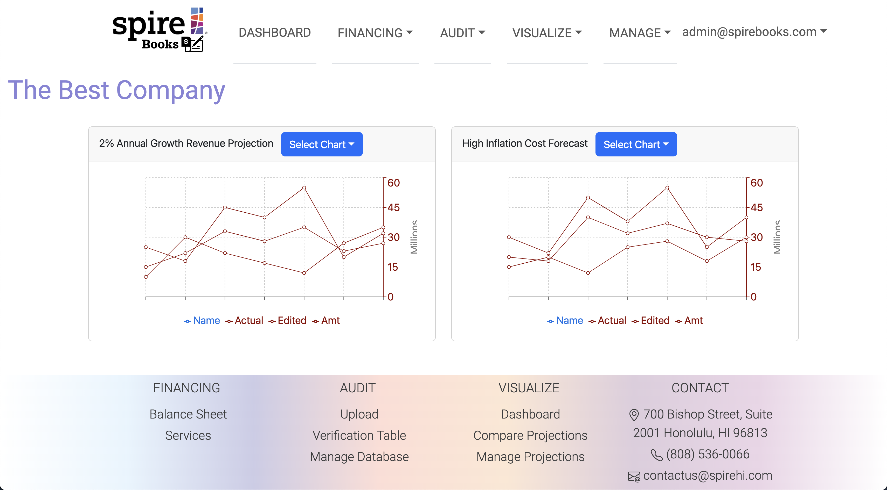

## Project Overview
SpireBooks is a management decision-making tool, made with the intent to facilitate and help organizations make informed financial and strategic decisions based on a comprehensive consolidation of financial data and integration of non-financial factors.
Our client, [Spire Hawaii](https://www.spirehawaii.com/), were looking to transform their financial sustainability model to a software platform that is more robust and user friendly. The financial sustainability model utilizes historical financial data as the base case and incorporates relevant variables and factors to create a future forward financial forecast and trending analysis.

Prior to the project, Spire was using Excel spreadsheets, which becomes too complicated and abstract for the average customer, who may lack previous economic or accounting knowledge. They also ran into issues where customers had difficulty visualizing the projections and understanding the dynamic nature of the data. SpireBooks is a web application where customers could input their financial data, an accountant could audit the data, an analyst could upload projections, and customers could view the financial forecasts of their company. 

## Personal Contributions
For this project, I mainly worked on the landing page, compare projections page, and manage projections page. Click on the images to view the source code.
### Landing

For the landing page, I wanted to keep the design simple, yet captivating. I animated the text, "Welcome to SpireBooks." to draw users attention to the page and kept the about info brief and to the point. I added the "Get Started" button to provide a call to action for the user, directing them to the Sign-Up page.

### Compare Projections

The Compare Projections page allows you to select two charts representing projections and compare them. Unfortunately, the projections database was not implemented in time for the final milestone, so it does not pull from actual data. The placeholder data was to provide a proof-of-concept for the client. If I were given more time to work on this project, I would have added numerical data below the charts as a quick snapshot overview of any differences two projections may have. This may be useful information for the customer, who may be using this information to determine a financial strategy.

### Manage Projections

The Manage Projections page should allow users to upload a .CSV file containing projection data or input data through a form. It should allow users to update any document or delete a projection from the database. It also should allow users to view and manage workpapers used in the calculations. 

Due to the complexity of the projections database, where different types of projections had different fields, thus requiring distinct schemas, the projections database was not implemented in time for the final milestone. Part of the complexity came from the client's request to do the forecast calculations through the software, which required pulling data from multiple sheets. Analyzing the provided Excel spreadsheets to extract the functions and which datasets were included proved itself to be a complicated task as well, as our team was unable to unpack the Excel spreadsheet on our own. It only became clear to me towards the of the project, that the workpapers were the financial projections I wanted to model. If I were to redo this project, I would have worked with the client to come up with a clear database design prior to implementation. Having a better understanding of the schema and what is needed in the database would have greatly aided me in developing this feature of the application.

### Overall Experience
 Overall, this was an exciting experience from which I learned many invaluable skills. As this was a semester-long project, I gained a lot of experience in the software development cycle, Issue-Driven Project Management, and cultivated my JavaScript and React skills. I also gained a lot of experience in code review, which was a collaborative process that helped me improve my code. I really enjoyed this process, since it helped me see what other people in my team was working on, and my team members provided me with suggestions that upgraded the code I was working on. Another skill I fostered were my interpersonal skills. For this project, I worked in an eight-person team, which was the largest group I have ever worked with before. As it was a large team, we placed importance on communication, which was reflected in our team contract. Since we all worked on different components on the application that overlapped and relied on each other, it became vital to communicate with each other about the progress of our individual issues. I also gained experience in working with a real client who is not in the software engineering industry, which meant implementing vague ideas that catered to the clients needs.
 
Finally, I would like to thank Spire Hawaii and Professor Moore for their time and support and for the opportunity to work on this project with them. It was truly an enriching experience that allowed me to apply my skills to a real-world scenario and grow both professionally and personally. This project has been a milestone in my journey as a developer, and I look forward to applying what I have learned to future endeavors.