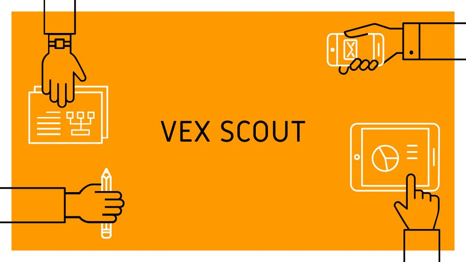

VEX Scout is a scouting app developed *by* VEX Robotics competitors *for* VEX Robotics competitors. 

In robotics competitions, scouting is the process of learning about your opponents' and allies' strengths and weaknesses to create strategies for each match. As members of our high school robotics team, we noticed that most rookie teams do not know how to effectively scout. Most teams use Google forms and worksheets to assist them in scouting. However, these solutions can be ineffective, as competition day can get very busy and you may be too focused on the robot or the competition to do the analytics. Our team's solution was to develop an app that can easily input and store data that teams can quickly access and analyze later.

For this project, I was the lead UI/UX designer and I was also responsible for coding the login page. Working on this project taught me how to develop apps using the Software Development Life Cycle. I also learned how to conduct user research and how to test my product. One of the most valuable experiences I got out of this project was being able to pitch the app to "community stakeholders" which improved my presentation skills greatly.